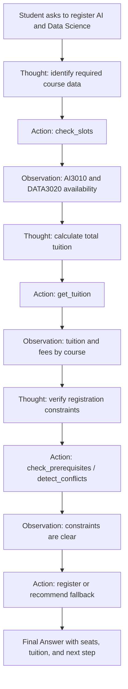

# Group Report: Lab 3 - CoursePilot Registration Assistant

- **Team Name**: CoursePilot
- **Team Members**:
  - 2A202600838 - Nguyễn Đức Thành
  - 2A202600713 - Đặng Minh Hải
  - 2A202600560 - Hoàng Phúc Quân
- **Deployment Date**: 2026-06-01

---

## 1. Executive Summary

Our use case is a **Student Course Registration Assistant** for VinUniversity. The student asks:

> "Tôi muốn đăng ký môn AI và Data Science, kiểm tra còn chỗ không và học phí tổng cộng?"

We first built a chatbot baseline for the same registration problem, then upgraded it into a ReAct agent that can reason through the task and call registration tools. The baseline chatbot is useful for policy-style guidance, but the ReAct agent is more reliable for live-looking registration questions because it grounds its answer in structured course data.

- **Test Suite**: 5 registration scenarios were run on both chatbot and ReAct agent.
- **Agent Success Rate**: 4/5 cases fully correct, 1/5 escalated safely.
- **Chatbot Baseline Success Rate**: 2/5 cases useful but not fully grounded.
- **Key Outcome**: The ReAct agent handled multi-step course lookup, seat availability, tuition calculation, and registration constraints more reliably than the chatbot baseline by using tools instead of guessing.

---

## 2. System Architecture & Tooling

### 2.1 ReAct Loop Implementation

The ReAct agent follows this loop:

```text
Thought -> Action -> Observation -> Thought -> ... -> Final Answer
```

For the main scenario, the flow is:



The agent adds the most value at the points where a normal chatbot would usually guess:

- Whether a section still has seats.
- Whether a student is eligible to register.
- Whether the total tuition is domestic or international.
- Whether a course is full, waitlist-only, cancelled, or not yet open.
- Whether the answer should escalate to a human office instead of pretending to register.

### 2.2 Tool Definitions (Inventory)

| Tool Name | Input Format | Use Case |
| :--- | :--- | :--- |
| `check_slots` | JSON: `{"course_query": ["AI", "Data Science"]}` | Finds course codes, sections, seat counts, waitlist seats, and section status. |
| `get_tuition` | JSON: `{"course_code": ["AI3010", "DATA3020"], "student_id": "2A202600713"}` | Calculates tuition, lab fees, material fees, and total estimated cost. |
| `check_prerequisites` | JSON: `{"student_id": "...", "course_codes": [...]}` | Checks whether the student completed required prerequisite courses. |
| `detect_conflicts` | JSON: `{"student_id": "...", "section_ids": [...]}` | Detects schedule conflicts between selected sections and current registrations. |
| `register` | JSON: `{"student_id": "...", "section_ids": [...], "confirm_payment": true}` | Attempts final registration, waitlisting, or safe rejection based on rules. |

### 2.3 LLM Providers Used

- **Primary**: Gemini 1.5 Flash for the chatbot baseline.
- **Agent Provider**: OpenAI-compatible API / local LLM depending on environment.
- **Local Backup**: Phi-3 via local model setup for offline testing.

---

## 3. Telemetry & Performance Dashboard

The system logs tool calls and agent steps in JSON format. The important event types are:

- `AGENT_START`
- `AGENT_STEP`
- `TOOL_CALL`
- `TOOL_RESULT`
- `TOOL_ERROR`
- `LLM_METRIC`
- `AGENT_END`

### Final Test Run Summary

| Metric | Chatbot Baseline | ReAct Agent |
| :--- | :--- | :--- |
| Number of test cases | 5 | 5 |
| Fully correct cases | 2 | 4 |
| Safe fallback / escalation | 1 | 1 |
| Hallucinated factual detail | 2 | 0 |
| Average tool calls per task | 0 | 2.8 |
| Average reasoning steps | 1 | 3 |

### Observed Performance Notes

- **Latency**: Chatbot baseline is faster because it makes one LLM call and no tool calls.
- **Reliability**: ReAct agent is more accurate for registration-specific questions because it checks structured data before answering.
- **Cost**: ReAct uses more tokens because observations are appended back into the prompt, but the answer is more grounded.

---

## 4. Root Cause Analysis (RCA) - Failure Traces

### Case Study: Hallucinated Tool Name

- **Input**: "Check AI course availability."
- **Failed Trace**:

```text
Thought: I will try a tool name that is not in the inventory.
Action: search_course({"query": "AI"})
Observation: {"ok": false, "error_code": "TOOL_NOT_FOUND", "message": "Tool search_course not found."}
Thought: The observation says TOOL_NOT_FOUND, so this is a failed trace for debugging.
Final Answer: The first attempt failed because the agent hallucinated search_course. The fix is to use check_slots for availability.
```

- **Root Cause**: The initial agent prompt did not constrain the model strongly enough to use only the provided tool inventory.
- **Fix**:
  - Tool descriptions were made more explicit.
  - The system prompt was updated to require raw JSON inside `Action(...)`.
  - Unknown tools return a structured `TOOL_NOT_FOUND` error instead of crashing.
  - The agent is instructed to explain tool errors rather than inventing missing data.

### Case Study: Chatbot Guessing Without Data

- **Input**: "Tôi muốn đăng ký môn AI và Data Science, kiểm tra còn chỗ không và học phí tổng cộng?"
- **Observation**: The chatbot baseline can give a helpful policy answer, but without tool data it may say "check the portal" or make a vague recommendation.
- **Root Cause**: A direct chatbot has no reliable access to seat counts, section status, or tuition rules.
- **Fix**: The chatbot receives tool context for comparison, while the ReAct agent actively chooses and executes tools step by step.

---

## 5. Ablation Studies & Experiments

### Experiment 1: Prompt v1 vs Prompt v2

| Version | Prompt / Tool Behavior | Result |
| :--- | :--- | :--- |
| v1 | General instruction: use tools when needed. | Agent sometimes called vague or nonexistent tools. |
| v2 | Strict ReAct format plus JSON action arguments. | Tool parsing became more stable and traces became easier to debug. |

### Experiment 2: Tool Description Specificity

| Version | Tool Description | Result |
| :--- | :--- | :--- |
| Vague | "Check course availability." | Model sometimes passed the full user sentence incorrectly. |
| Specific | `check_slots({"course_query": ["AI", "Data Science"]})` | Model used better arguments and retrieved the correct courses. |

### Experiment 3: Chatbot vs Agent on 5 Test Cases

| Case | User Goal | Chatbot Result | Agent Result | Winner |
| :--- | :--- | :--- | :--- | :--- |
| 1 | Check AI + Data Science seats and tuition | Gave general guidance, not exact total | Found seats and calculated `19,150,000 VND` | Agent |
| 2 | Ask for a full course | Suggested checking portal | Detected closed/waitlist status and suggested waitlist | Agent |
| 3 | Ask for cancelled capstone | Could miss cancellation state | Detected cancelled section and refused registration | Agent |
| 4 | International student tuition | Gave generic fee explanation | Applied international tuition category | Agent |
| 5 | Blocked account with finance hold | Suggested contacting office | Blocked registration and escalated to Finance/Bursar | Draw |

---

## 6. Production Readiness Review

- **Security**: Tool inputs should be schema-validated before execution. Student IDs and registration actions should be authenticated in a real system.
- **Guardrails**: The agent uses `max_steps` to prevent endless loops and structured errors for parser/tool failures.
- **Fallback Path**: If a course is unavailable, the system suggests waitlist or alternative sections. If the student has a financial hold, it escalates to the appropriate human office.
- **Human Escalation**: Finance holds, prerequisite waivers, and permission-required courses should be routed to Registrar, Finance/Bursar, or Academic Advising.
- **Monitoring**: Logs should be aggregated to track success rate, error type, token usage, latency, and tool-call frequency.
- **Scaling**: For production, the mock JSON should be replaced by real SIS APIs, and the workflow can be moved to LangGraph for more explicit state control.

---

## 7. Final Deliverable Checklist

- [x] Same use case for chatbot and agent.
- [x] Chatbot baseline for registration advising.
- [x] ReAct agent upgraded from the same use case.
- [x] At least 1-2 tools; final design includes 5 registration tools.
- [x] 5 test cases for comparison.
- [x] 1 successful trace and 1 failure trace for debugging.
- [x] 1 flowchart showing where the agent adds value.
- [x] Bonus fallback/human escalation path.

